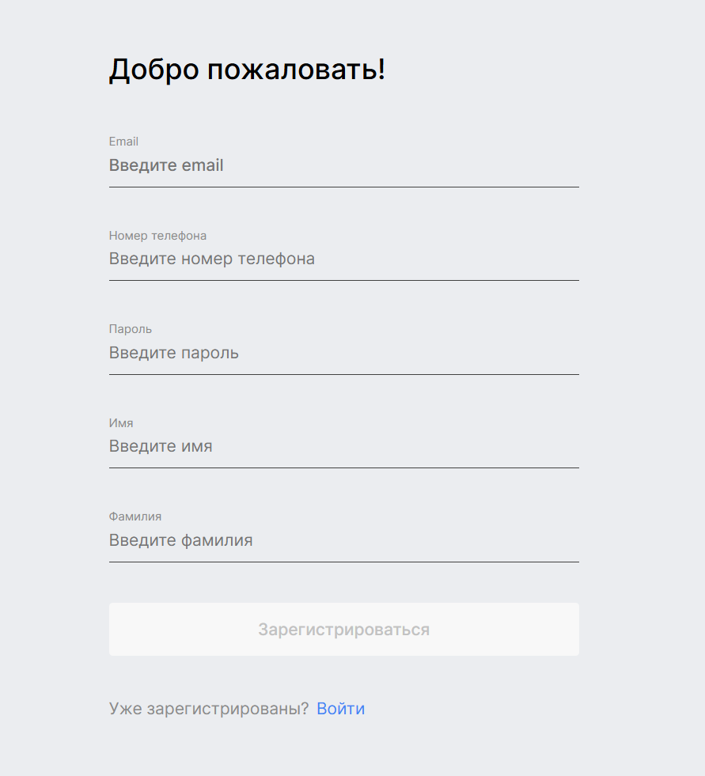
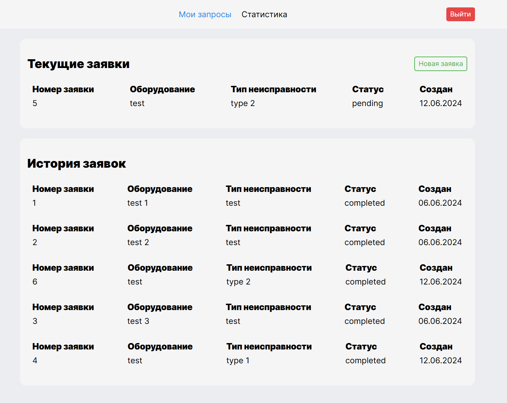
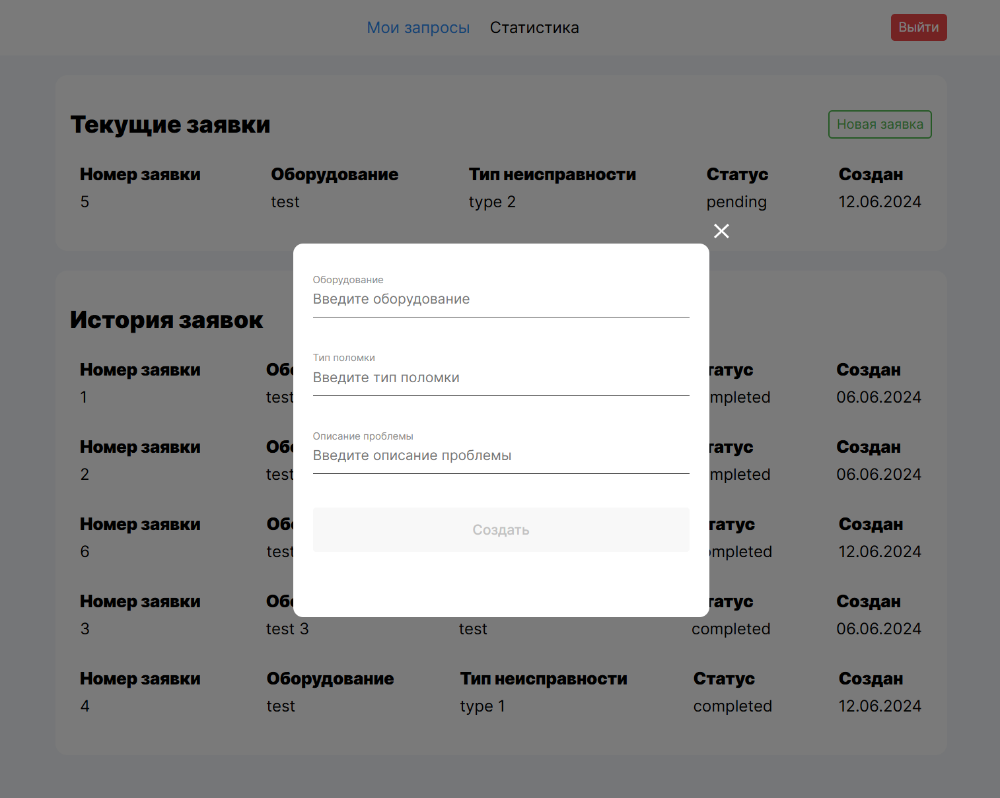
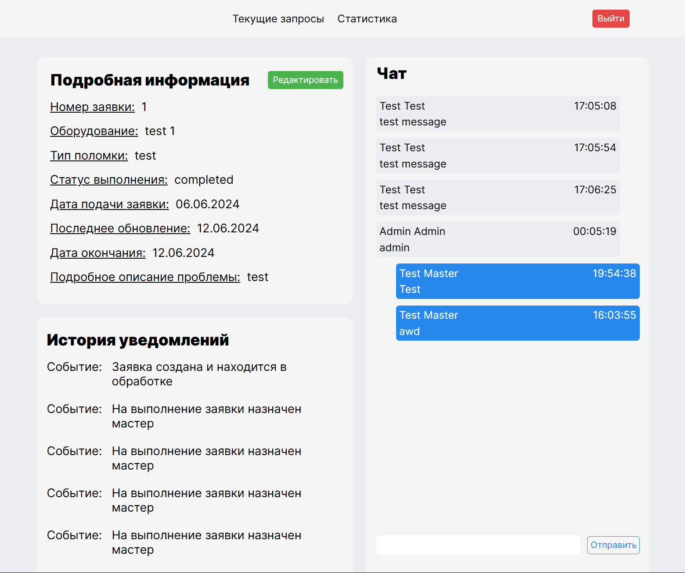
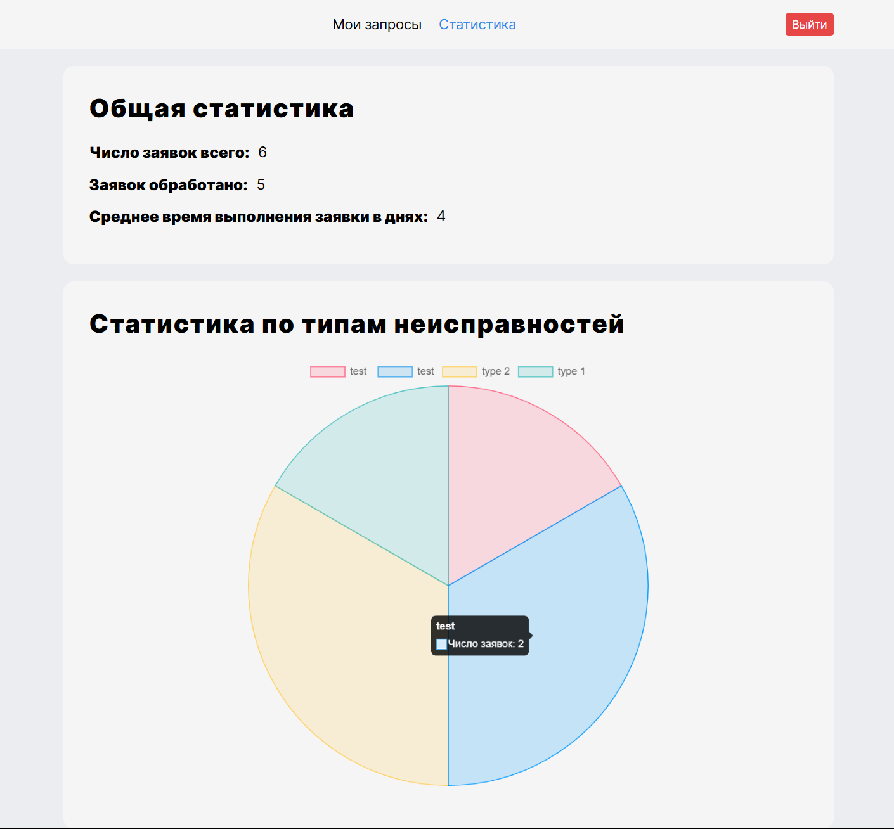

# Техносервис - система управления заявками на ремонт оборудования

## Описание проекта

Веб-приложение для организации процесса ремонта оборудования между клиентами, мастерами и администраторами сервисного центра. Система автоматизирует процесс подачи, назначения и выполнения заявок с возможностью общения между всеми участниками процесса.

## Основные функции

### Для клиентов:
- 📝 Создание заявок на ремонт с указанием:
  - Названия оборудования
  - Типа поломки
  - Подробного описания проблемы
- 💬 Общение в чате заявки с мастером и администратором
- 📊 Просмотр истории своих заявок
- 🔍 Отслеживание статуса выполнения заявки

### Для мастеров:
- 👨‍🔧 Просмотр назначенных заявок
- 🔄 Изменение статуса заявки (в работе, выполнено и т.д.)
- ✉️ Общение с клиентом и администратором через встроенный чат
- 📈 Просмотр статистики выполненных работ

### Для администраторов:
- 👥 Управление пользователями
- 🎯 Назначение мастеров на заявки
- 👀 Мониторинг всех активных заявок
- 📩 Участие в чатах для решения спорных вопросов
- 📊 Формирование отчетов по выполненным работам

## Технологический стек

### Frontend
- **Vite** - инструмент сборки проекта
- **React 18** - библиотека для построения клиентской логики
- **TypeScript** - статическая типизация
- **Redux Toolkit** - управление состоянием приложения
- **React Router v6** - навигация между страницами
- **Sass** - препроцессор CSS
- **Chart.js** - визуализация статистики

### Backend
Серверная часть проекта доступна в отдельном репозитории:  
[techservice-backend](https://github.com/X5HR7/technoservice-backend)

## Интерфейсы приложения

### Основные экраны:
1. **Авторизация** (единая форма входа для всех ролей)

2. **Лента заявок** (отображается согласно правам пользователя)

3. **Создание заявки** (форма для клиентов)

4. **Профиль заявки** с:
   - Детальной информацией
   - Историей изменений статуса
   - Встроенным чатом

5. **Статистика** (общая статистика по выполненной работе)

## Особенности реализации

1. **Ролевая модель**:
   - Различные интерфейсы для разных типов пользователей
   - Динамическая подгрузка компонентов в зависимости от роли

2. **Чат**:
   - Уведомления о новых сообщениях
   - История переписки

3. **Система уведомлений**:
   - О назначении на заявку (для мастера)
   - Об изменении статуса (для клиента)
   - О новых сообщениях в чате

---

Проект разработан для оптимизации работы сервисного центра и улучшения взаимодействия между клиентами и исполнителями.